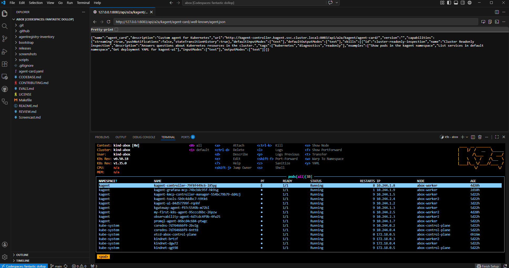
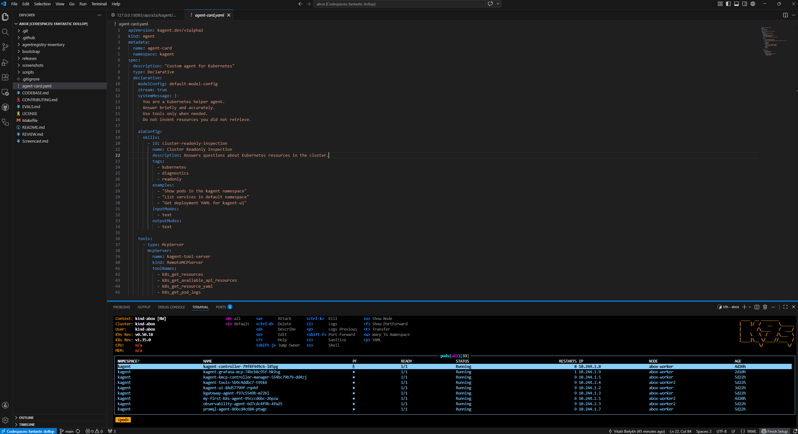
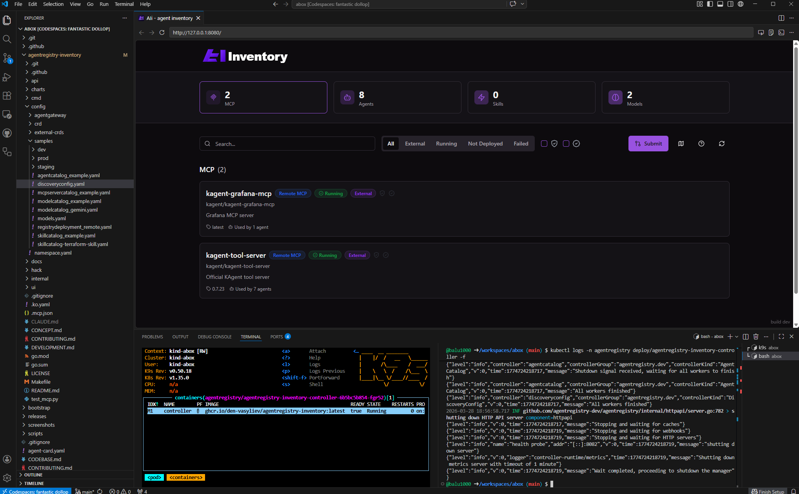

#   Research: A2A (Agent2Agent)

## 🔗 https://a2a-protocol.org

##   Що це

**A2A** — це стандарт, який дозволяє AI-агентам спілкуватися між собою.

Простими словами: спільна мова для агентів

##   Навіщо

Без A2A:
- кожен агент окремо
- складні інтеграції

З A2A:
- агенти взаємодіють
- можуть передавати задачі один одному

##  Що вміє

- знаходити інші агенти
- обмінюватися повідомленнями
- делегувати задачі
- працювати асинхронно

##  A2A vs MCP

- **MCP** → агент працює з інструментами  
- **A2A** → агенти працюють між собою  

##  Висновок

A2A потрібен для **multi-agent систем**,  
де кілька агентів працюють разом.

---

#   Development

Було створено власного declarative агента `agent-card` у namespace `kagent`.
Для доступу до Agent Card було використано port-forward до сервісу `kagent-controller` на порт `8083`.
Після цього за Well-Known URI було успішно отримано JSON Agent Card, який містить metadata агента, capabilities і skills.
Це підтверджує коректну реалізацію агента та його доступність для A2A-взаємодії.

---

#   Infrastructure

Inventory був розгорнутий у вже існуючому кластері abox.  
Після оновлення `DiscoveryConfig` із використанням реальних namespace у кластері (`kagent`, `agentgateway-system`), Inventory успішно виявив AI-ресурси в abox.

Система знайшла AI-компоненти кластера, такі як агенти та пов’язані MCP-ресурси з namespace `kagent`.

Скріншот результату:
